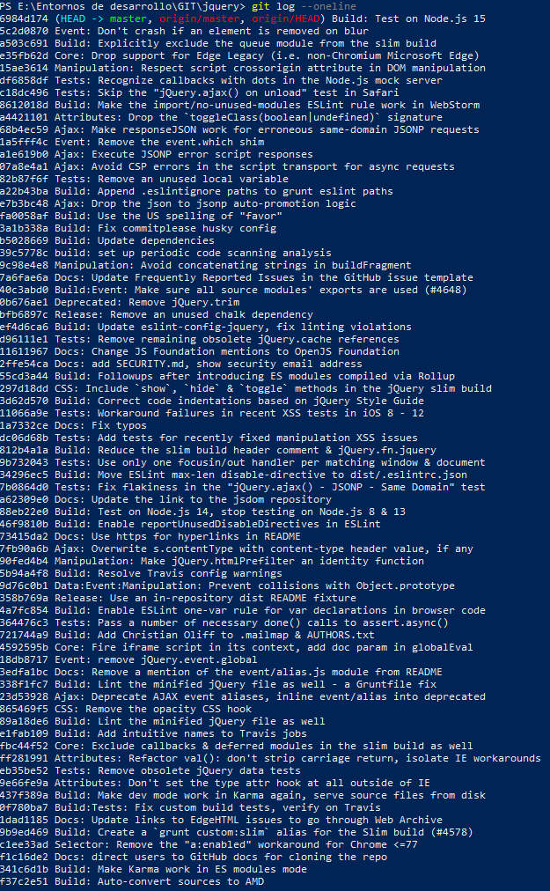
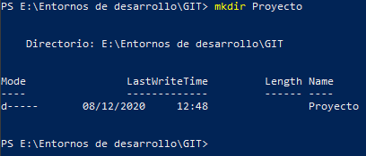

# Práctica GIT inicial

## Clonar repositorio externo
1. En un terminal posicionaros donde se creará el directorio del proyecto.  

2. Clonar el proyecto de la libreria Jquery que lo mantiene en github.
++* https://www.github.com/jquery/jquery.git  

3. Entrar en el directorio creado (jquery) y mostrad un log de los estados por los que ha pasado el proyecto.  
  

## Crear un repositorio local

1. Crear un directorio donde vamos a empezar el proyecto y acceder a él.  

2. Inicializar el repositorio  

3. Cread un primer archivo "archivo1.txt"  

4. Visuaalizad el estado del proyecto  

5. Pasad el archivo del espacio de trabajo a la zona de preparación.  

6. Visualizad de nuevo el estado del proyecto  

7. Realizad el primer commit y visualizad de nuevo el estado del proyecto.  

8. Cread dos archivos más al proyecto. "archivo2.txt" y "archivo3.txt"  

9. Pasad el segundo archivo a la zona de preparación.  

10. Segundo commit del proyecto.  

11. Añadid el ultimo archivo a la zona de preparación y realizad el commit.  

12. Mostrad el log de todos los cambios.  

13. Cambiad el archivo "archivo1.txt" y verificad el estado de git.  

14. Pasad el archivo a la zona de preparación.  

15. Modificad los archivos 2 y 3 del proyecto. Verificad estado del git.  

16. Pasad los archivos 2 y 3 a la zona de preparación.  

17. Realizar el commit de los cambios realizados.  

18. Mostrad el log de todos los cambios  
